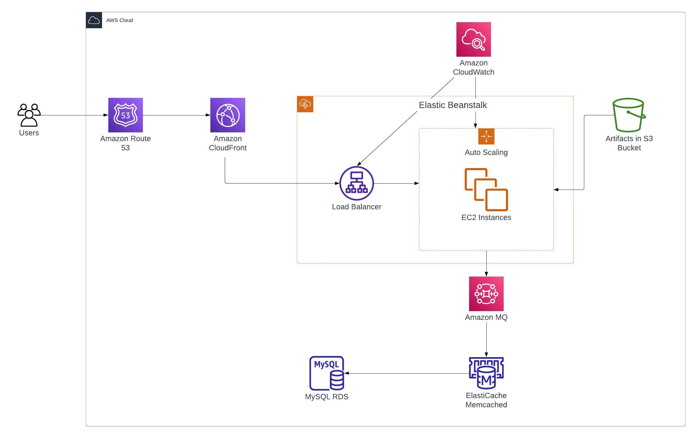

# 3-Tier Weh Application Lift and Shift to AWS Cloud Platform
This is a distributed web application complete with a web server, 
database and along with other functionality.

## Architecture

## Prerequisites
- JDK 1.8 or later
- Maven 3 or later

## Services
- Tomcat --> Application Server
- ActiveMQ(RabbitMQ) --> Broker/Queuing Agent
- Elasticache(Memcache) --> DB Caching
- RDS(MySQL) --> SQL Database
- ElasticSearch --> Indexing/Search Service

## Procedure
Upon deployment, the web application is available on `<< YOUR DOMAIN >>`, globally distributed to all AWS edge locations with Amazon CloudFront

### Setup
The setup instructions are in the **journal** directory.

## Technologies 
- Spring MVC
- Spring Security
- Spring Data JPA
- Maven
- JSP
- MySQL
  
## Database
Here, we used Mysql DB on Amazon RDS offering

Look for the file :
- /src/main/resources/db_backup.sql
- The file contains the scheme to dump into your database server.
- > mysql -u <user_name> -p accounts < db_backup.sql

## Versions
Tomcat:
  - 9.0.75 on centos9
  
Java:
  - 1.8.0 on centos9

## Troubleshooting Common Errors
1. If your apps are deployed successfully, however you are unable to log in on the webpage successfully, you could check out database connection with `telnet IP_Address PORT`