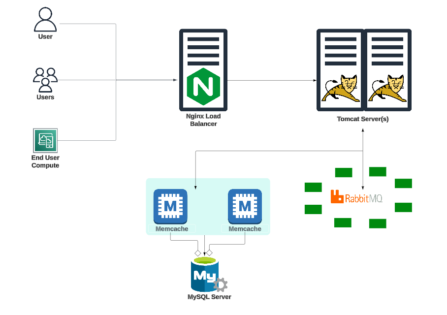

# 3-Tier Automated Application Setup on Ubuntu Servers with Shell Scripts for Vagrant
This is a distributed web application complete with a web server, 
database and along with other functionality.

## Architecture


## Prerequisites
- JDK 1.8 or later
- Maven 3 or later
- MySQL 5.6 or later

## Services
- Nginx --> Web Service
- Tomcat --> Application Server
- RabbitMQ --> Broker/Queuing Agent
- Memcache --> DB Caching
- ElasticSearch --> Indexing/Search Service
- MySQL --> SQL Database

## Procedure
The web application is available on `http://web01`
### Automated Setup
The `vagrant/Automated_Provisioning` directory contains a Vagrantfile
along with installation shell scripts to automate the start up and
configuration of all the services with a simple command in the directory:
```
vagrant up
```


### Manual Setup
In the `vagrant/Manual_Provisioning` folder, the **Vagrantfile** 
automates the creation of 5 VMs in virtualbox. 
This serves as a template for creating a **Vagrant Multi-Machine** setup.
Execute the following command to create them:
```
cd vagrant/MY_Provisioning
vagrant up
```

Do note that you will then have to manually install and setup each
server following the instructions in the `local-setup.md` file in the
same folder.


## Technologies 
- Spring MVC
- Spring Security
- Spring Data JPA
- Maven
- JSP
- MySQL
  
## Database
Here, we used Mysql DB 
MSQL DB Installation Steps for Linux ubuntu 14.04:
- $ sudo apt-get update
- $ sudo apt-get install mysql-server

Then look for the file :
- /src/main/resources/accountsdb
- accountsdb.sql file is a mysql dump file. We have to import this dump to mysql db server
- > mysql -u <user_name> -p accounts < accountsdb.sql


## Troubleshooting Common Errors
1. If your apps are deployed successfully, however you are unable to
log in on the webpage `http://web01` successfully. Run the following commands in the Vagrantfile directory to ssh into the database server and restart the firewall:
```
vagrant ssh db01
sudo systemctl restart firewalld
```

